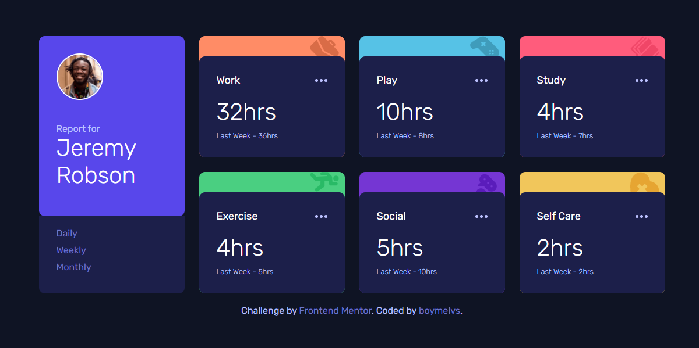

# Frontend Mentor - TIME TRACKING DASHBOARD SOLUTION

## Table of contents

-  [Overview](#overview)
   -  [The challenge](#the-challenge)
   -  [Screenshot](#screenshot)
   -  [Links](#links)
   -  [Built with](#built-with)
-  [Author](#author)

## Welcome! 👋

Thanks for checking out this front-end coding challenge.

## Overview

This is a solution to the [Time tracking dashboard challenge on Frontend Mentor](https://www.frontendmentor.io/challenges/time-tracking-dashboard-UIQ7167Jw).

### The challenge

Users should be able to:

-  View the optimal layout for the site depending on their device's screen size
-  See hover states for all interactive elements on the page
-  Switch between viewing Daily, Weekly, and Monthly stats

### Screenshot

### Links

-  Live Site URL: [Time tracking dashboard solution](https://boymelvs.github.io/time-tracking-dashboard-main/)

### Built with

-  HTML
-  Flexbox
-  CSS
-  Grid
-  Javascripts

## Author

-  Frontend Mentor - [Melvin](https://www.frontendmentor.io/profile/boymelvs)
